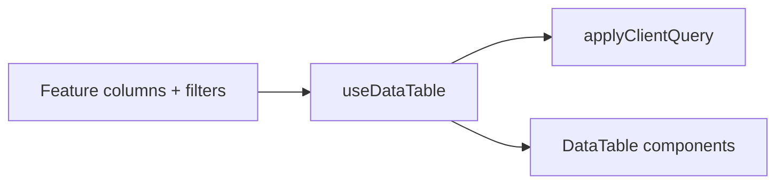

# Data Table System

## When to use

**Always** use this system for tabular/list UIs with any combination of:
- search
- column sorting
- filters (status, scope, type, etc.)
- pagination
- responsive desktop table + mobile cards

**Do not** create one-off `<table>` markup with inline filter/sort/pagination state.

Reference implementation (migrate toward shared base): `components/profile/profile-table.tsx`

---

## Canonical file layout

Create or extend these paths — do not duplicate logic elsewhere:

```
components/data-table/
  types.ts
  data-table.tsx
  data-table-toolbar.tsx
  data-table-pagination.tsx
  data-table-sort-header.tsx
  data-table-empty-state.tsx

hooks/
  use-data-table.ts

lib/data-table/
  apply-client-query.ts
  create-search-matcher.ts
  compare-values.ts
```

If a file is missing, **add it to the shared base first**, then consume it from the feature screen.

---

## Architecture

| Layer | Responsibility |
|-------|----------------|
| `useDataTable` | search, sorting, pagination, filters state + TanStack table instance |
| `applyClientQuery` | filter → search → sort → paginate (client mode) |
| `DataTable` UI | toolbar, desktop table, mobile cards, pagination, empty state |
| Feature screen | column defs, cell renderers, filter UI, row actions, dialogs |



---

## Workflow: new table screen

Copy this checklist:

```
- [ ] 1. Define row type T (e.g. Lead, ProfileRecord)
- [ ] 2. Wire useDataTable<T> with data + searchKeys + filterFn
- [ ] 3. Define ColumnDef<T>[] with DataTableSortHeader for sortable cols
- [ ] 4. Render <DataTable> with toolbar, pagination, renderMobileRow
- [ ] 5. Keep dialogs/drawers in feature — not in shared components
- [ ] 6. Verify RTL (text-start, dir={dir}) and mobile (< lg cards)
```

### Step 1 — Hook setup (client mode default)

```tsx
const { dir } = useTranslation();

const dataTable = useDataTable<Lead>({
  data: leads,
  initialPageSize: 10,
  initialSorting: [{ id: 'createdAt', desc: true }],
  initialFilters: { status: 'all' },
  searchKeys: ['id', 'name', 'phone', 'email'],
  filterFn: (row, filters) =>
    filters.status === 'all' || row.status === filters.status,
});
```

### Step 2 — Columns (feature-owned)

```tsx
const columns = useMemo<ColumnDef<Lead>[]>(() => [
  {
    accessorKey: 'name',
    header: ({ column }) => (
      <DataTableSortHeader column={column} label={dir === 'rtl' ? 'الاسم' : 'Name'} />
    ),
    cell: ({ row }) => <span className="font-bold">{row.original.name}</span>,
  },
  // actions column: view / edit / delete buttons
], [dir]);
```

Pass `columns` into `useDataTable` or bind via `useReactTable` inside the hook.

### Step 3 — Render shell

```tsx
<DataTable
  dir={dir}
  table={dataTable.table}
  rows={dataTable.rows}
  columns={columns}
  title={...}
  description={...}
  toolbar={
    <DataTableToolbar
      search={dataTable.search}
      onSearchChange={dataTable.setSearch}
      searchPlaceholder={dir === 'rtl' ? 'بحث...' : 'Search...'}
      filters={<StatusFilter value={dataTable.filters.status} onChange={...} />}
      actions={<Button onClick={onCreate}>Add</Button>}
    />
  }
  pagination={
    <DataTablePagination
      dir={dir}
      pageIndex={dataTable.pagination.pageIndex}
      pageCount={dataTable.pageCount}
      totalRows={dataTable.totalRows}
      currentStart={dataTable.currentStart}
      currentEnd={dataTable.currentEnd}
      onFirstPage={() => dataTable.table.setPageIndex(0)}
      onPreviousPage={() => dataTable.table.previousPage()}
      onNextPage={() => dataTable.table.nextPage()}
      onLastPage={() => dataTable.table.setPageIndex(dataTable.pageCount - 1)}
      canPreviousPage={dataTable.table.getCanPreviousPage()}
      canNextPage={dataTable.table.getCanNextPage()}
    />
  }
  renderMobileRow={(row) => <LeadMobileCard lead={row} />}
  emptyMessage={dir === 'rtl' ? 'لا توجد نتائج.' : 'No results found.'}
/>
```

---

## `useDataTable` contract

### Options

```ts
type UseDataTableOptions<T> = {
  data: T[];
  columns: ColumnDef<T>[];
  mode?: 'client' | 'server';           // default 'client'
  initialPageSize?: number;             // default 10
  initialSorting?: SortingState;
  initialFilters?: DataTableFilterState;
  searchKeys?: (keyof T | ((row: T) => string))[];
  filterFn?: (row: T, filters: DataTableFilterState) => boolean;
  fetchPage?: (params: ServerQueryParams) => Promise<DataTableQueryResult<T>>;
};
```

### Return (stable API)

```ts
{
  table, rows, totalRows, pageCount,
  currentStart, currentEnd,
  search, setSearch,
  sorting, setSorting,
  pagination, setPagination,
  filters, setFilter, resetFilters,
  isLoading,
}
```

### Rules

1. Reset `pageIndex` to `0` when `search`, `filters`, or `sorting` changes.
2. Client pipeline order: **filter → search → sort → paginate**.
3. Server mode: set `manualPagination` + `manualSorting`; delegate to `fetchPage`.

---

## UI rules (mandatory)

### RTL / LTR

- Set `dir={dir}` once on `DataTable` root.
- Use **logical** classes: `text-start`, `justify-start`, `ps-*`, `pe-*`, `start-*`.
- **Never** use `flex-row-reverse` + `text-right`/`text-left` pairs for direction.
- **Never** hardcode `dir="ltr"` on pagination.

### Pagination arrows

Swap icons by direction inside `DataTablePagination`:

```ts
const PrevIcon = dir === 'rtl' ? ChevronRight : ChevronLeft;
const NextIcon = dir === 'rtl' ? ChevronLeft : ChevronRight;
```

### Responsive

- `< lg`: card list via `renderMobileRow` (required).
- `>= lg`: desktop `<table>` with `overflow-x-auto` only as fallback.
- Toolbar: search + actions stack full-width on mobile.
- Dialogs: `max-h-[92vh] overflow-y-auto`, bottom-sheet on mobile.

### Styling

Match existing tokens: `var(--surface)`, `var(--border)`, `var(--text)`, `var(--text-muted)`, `rounded-2xl`, `primary` accents. Reuse `Button`, `Input` from `components/ui/`.

---

## What stays in the feature (not shared)

- Column definitions and cell renderers (badges, avatars, status chips)
- Row action handlers (view, edit, delete, mark complete)
- Filter controls specific to domain (status tabs, scope from route)
- Create/edit/detail dialogs and drawers
- API endpoints and mutation logic

---

## Migrating existing tables

| Current | Action |
|---------|--------|
| `components/profile/profile-table.tsx` | First migration target — extract hook + UI, keep profile-specific dialogs |
| `features/admin-leads/components/leads-table.tsx` | Replace inline filter in `use-admin-leads` with `useDataTable` |
| Any new admin list | Start with shared base — no new raw `<table>` |

When touching an existing table for any reason, **migrate it** to the shared system if it is not already using it.

---

## Server mode (future API)

```tsx
useDataTable<ProfileRecord>({
  mode: 'server',
  data: [],
  columns,
  fetchPage: async ({ search, sorting, pagination, filters }) => {
    const res = await apiService.get('/records', { params: { search, ... } });
    return { rows: res.data, totalRows: res.total, pageCount: res.pageCount };
  },
});
```

Same `DataTable` UI; only the query executor changes.

---

## Anti-patterns

- ❌ Inline `useState` for search + manual `.filter()` in feature hooks
- ❌ Copy-pasting pagination buttons per screen
- ❌ `min-w-[860px]` table without mobile card fallback
- ❌ Sort buttons duplicated per column
- ❌ Building a "simpler" local table "just this once"

---

## Additional resources

- Full walkthrough: [examples.md](examples.md)
